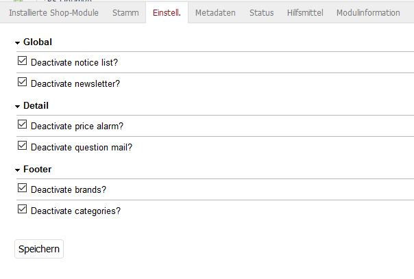

# Oxid deactivate

## Description 

You can easy disable functions of the oxid shop by make some settings in the admin area.

This module was created for Oxid 6.x, Wave Theme.

## Install

1. Copy files into following directory

        source/modules/rs/deactivate
        
        
2. Add to composer.json at shop root
  
        "autoload": {
            "psr-4": {
                "rs\\deactivate\\": "./source/modules/rs/deactivate"
            }
        },

3. Refresh autoloader files with composer.

        composer dump-autoload
        
4. Enable module in the oxid admin area, Extensions => Modules
5. Changes settings in the module itself

